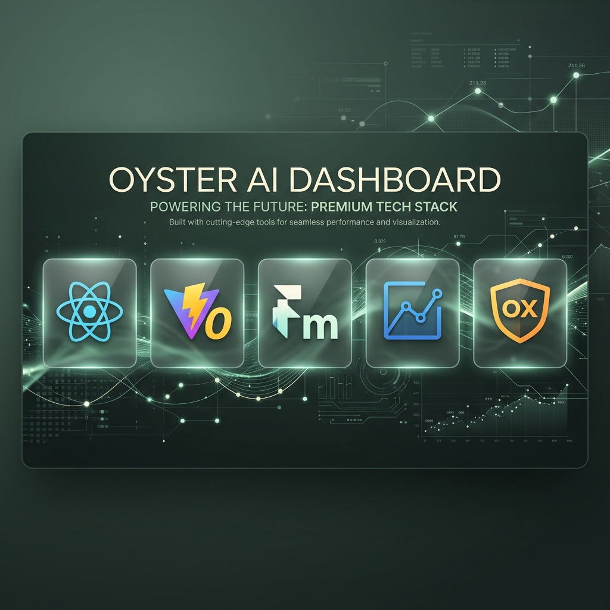
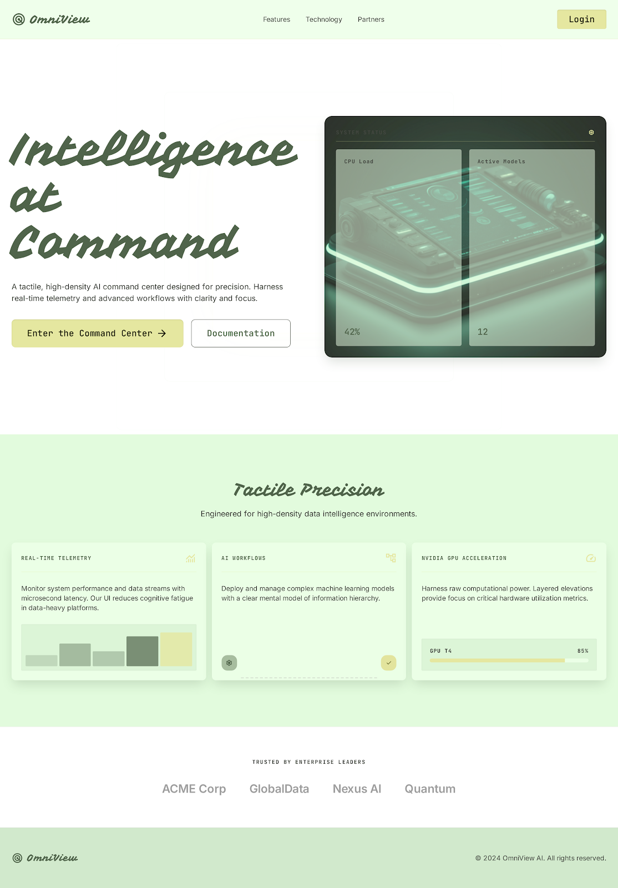
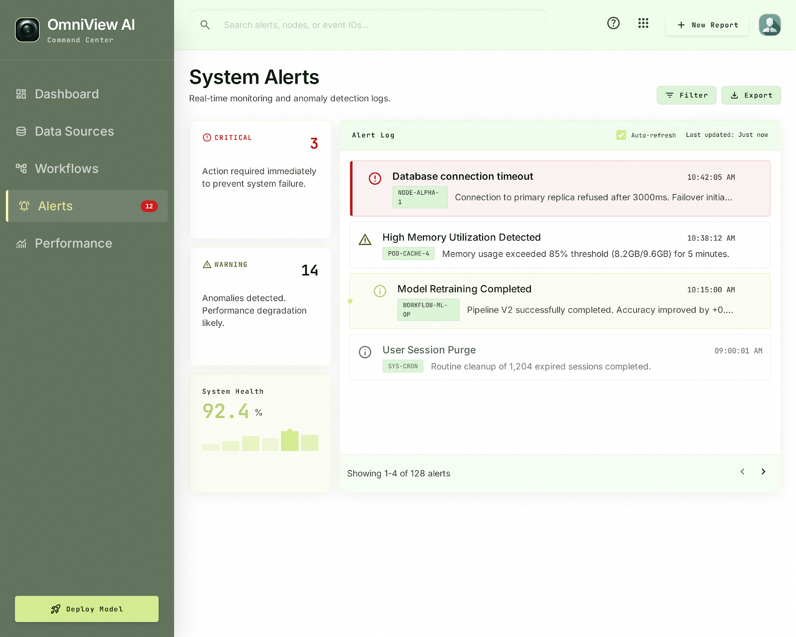
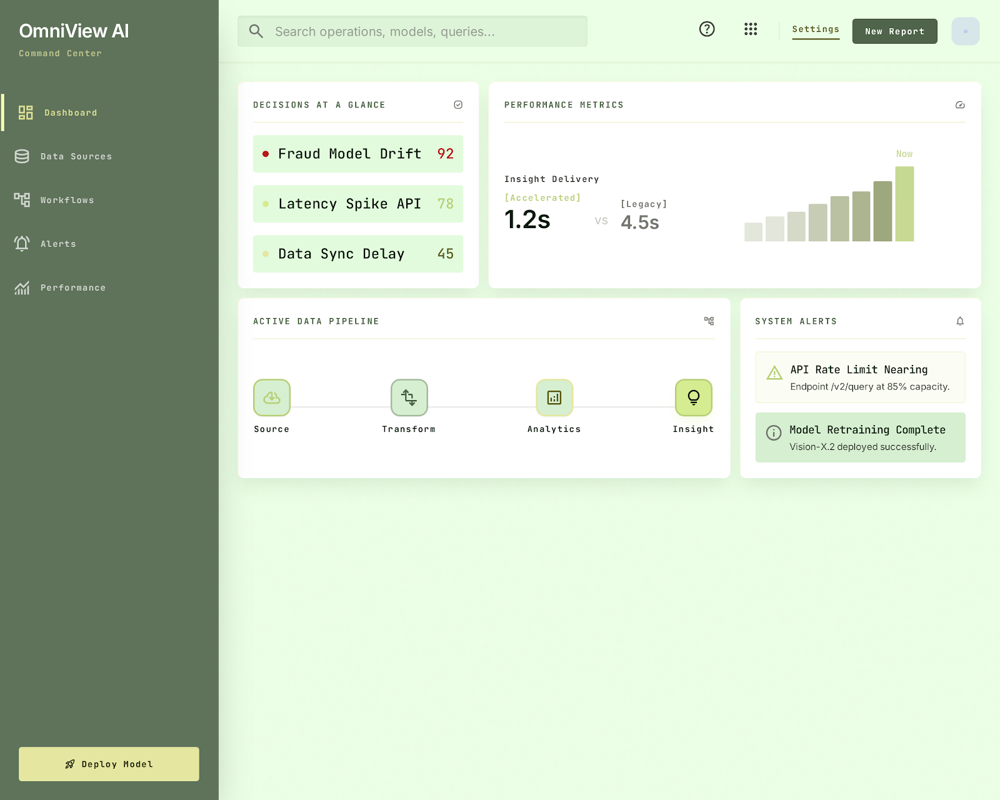
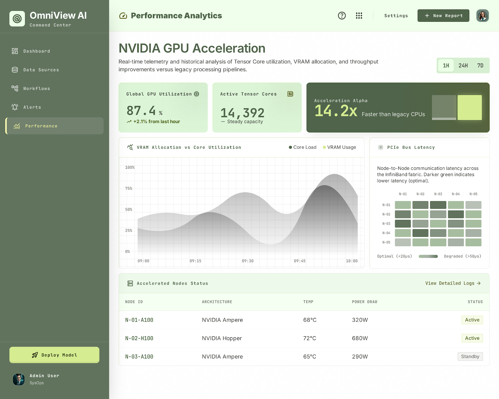
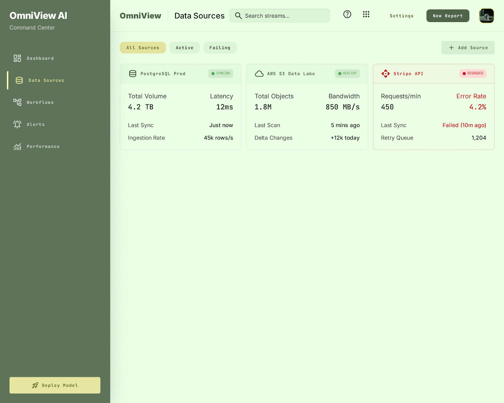
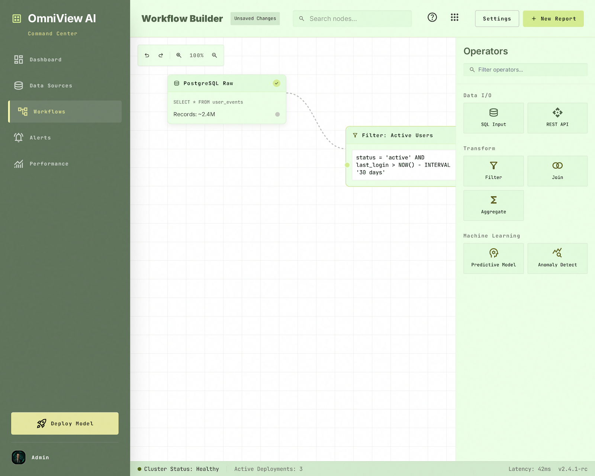

# 🦪 Oyster AI — Command Center

<p align="center">
  
</p>

<p align="center">
  <strong>High-fidelity React command center for AI workflows, GPU telemetry, and real-time database pipeline execution.</strong>
</p>

<p align="center">
  <a href="#-key-modules">Key Modules</a> •
  <a href="#-design-philosophy">Design Philosophy</a> •
  <a href="#-tech-stack">Tech Stack</a> •
  <a href="#%EF%B8%8F-development-guide">Development Guide</a>
</p>

---

## 🚀 Overview

**Oyster AI** is a production-ready, high-fidelity AI management dashboard. Designed with an editorial-quality layout and tactile precision, it serves as an enterprise command center for orchestrating complex AI workflows, monitoring hardware performance metrics, and managing database connections. 

The application is built on a master-detail SPA architecture, utilizing **React**, **Vite**, **Framer Motion** for fluid micro-interactions, and **Recharts** for real-time telemetry rendering.

---

## 🖼️ Core Modules & Interface Showcase

The system is organized into six distinct interactive views, each designed for high-density information display:

### 1. Enterprise Landing Page
An editorial-quality marketing front-page showing enterprise trust indicators, feature cards, and interactive high-level metrics designed to engage operators.
<p align="center">
  
</p>

### 2. Operations Dashboard
The primary landing hub for operators. It displays real-time performance summaries, an active data pipeline tracker, and critical telemetry streams in a balanced 2x2 grid.
<p align="center">
  
</p>

### 3. Data Source Connectors
Management panel for local and cloud data sources (PostgreSQL, AWS S3, Stripe API). Features connection state indicator dots (syncing, healthy, degraded) and data schema records.
<p align="center">
  
</p>

### 4. Workflow DAG Builder
An interactive, canvas-style workflow designer. Operators can construct complex execution DAGs (Directed Acyclic Graphs) using data inputs, ML models, filter operators, and notification actions.
<p align="center">
  
</p>

### 5. Performance & Hardware Analytics
Deep hardware instrumentation panel tracking GPU utilization, Tensor Core activity, and PCIe bus latency using an interactive heatmap matrix.
<p align="center">
  
</p>

### 6. System Alerts & Severity Logs
High-density log stream with severity-based filtering (Critical, Warning, Info) and real-time alerts showing hardware and API rate limit notifications.
<p align="center">
  
</p>

---

## 🎨 Design System & Philosophy

Oyster AI adheres to a strict **"Tactile Precision"** design philosophy defined in `src/index.css`. The branding avoids generic modern UI trends in favor of an editorial-style museum layout.

### Palette & Color Tokens
The interface utilizes an organic, grounded color palette:
*   **Sage (`--sage-900` to `--sage-50`)**: Dominant corporate styling, menus, and text elements.
*   **Mint (`--mint-100`, `--mint-50`)**: Crisp, light background layers providing visual breathing room.
*   **Cream (`--cream-100`, `--cream-50`)**: Soft contrast panels giving cards a premium, tactile physical feel.
*   **Accent Lime (`--accent-lime`)**: High-contrast indicator for focus highlights and primary actions.

### Typography
*   **Vampiro One**: Used exclusively for brand identity logos.
*   **JetBrains Mono**: Used for all system values, tabular data, status tags, and code blocks.
*   **Inter**: Utilized for clean body copy and structural descriptions.

---

## 🛠️ Tech Stack & Dependencies

The command center leverages modern web tools optimized for speed and rendering performance:

*   **Runtime Core**: React (v19) SPA architecture with dynamic client-side routing via `react-router-dom`.
*   **Build Bundler**: Vite (v8) for near-instant hot module replacement (HMR).
*   **Animation Engine**: Framer Motion for hardware-accelerated route page transitions and micro-interactions.
*   **Telemetry Visuals**: Recharts for responsive, styled SVG charting components.
*   **Linter Tool**: Oxlint for ultra-fast, Rust-based codebase analysis.

---

## ⚙️ Development Guide

### Prerequisites
Make sure you have Node.js (v18+) installed.

### Installation
Clone the repository and install the dependencies:
```bash
npm install
```

### Local Development
Run the Vite development server locally:
```bash
npm run dev
```
The application will start on `http://localhost:5173`.

### Code Quality & Linting
Run the Oxlint linter to verify code consistency:
```bash
npx oxlint
```

### Production Build
Create an optimized production bundle:
```bash
npm run build
```
Preview the production build:
```bash
npm run preview
```
